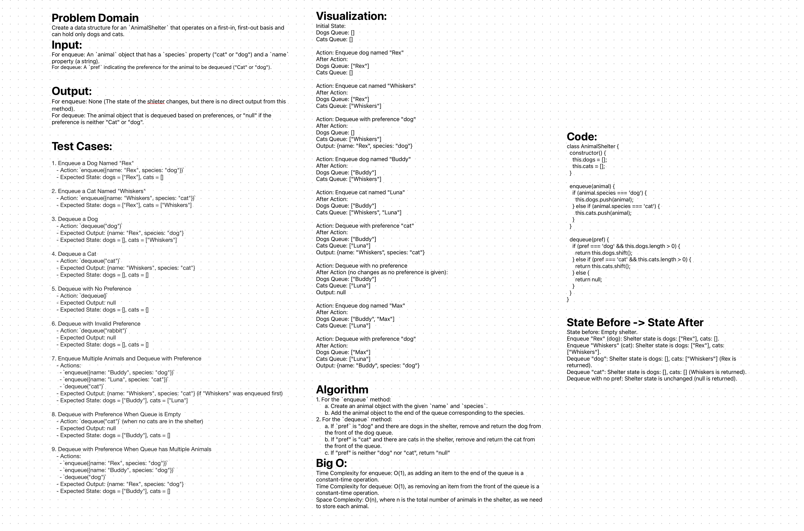

# Stack-Queue-Animal-Shelter

Create a data structure for an `AnimalShelter` that operates on a first-in, first-out basis and can hold only dogs and cats. 


## Whiteboard Process
;

## Approach & Efficiency

The `AnimalShelter` class uses two separate queues: one for dogs and another for cats. This segregation simplifies the process of tracking and managing the animals based on their species.

**Enqueueing Animals**: The `enqueue` method adds an animal to the end of its respective queue, depending on whether it's a dog or a cat. This operation is O(1) in time complexity, as it involves a simple append operation to the end of a list.

**Dequeueing Animals**: The `dequeue` method removes an animal from the front of its respective queue, based on the specified preference ('dog' or 'cat'). If the preference is neither 'dog' nor 'cat', the method returns null. This operation also has a time complexity of O(1), as it involves removing an element from the front of a list.

The space complexity of the `AnimalShelter` class is O(n), where n is the total number of animals (dogs and cats) in the shelter, since it needs to store each animal.

This approach efficiently manages the shelter's FIFO policy and allows for quick adoption processing based on species preference.

## Solution

```js
'use strict';

class Animal {
    constructor(name, species) {
        this.name = name;
        this.species = species;
    }
}

class AnimalShelter {
    constructor() {
        this.dogs = [];
        this.cats = [];
    }

    enqueue(animal) {
        if (animal.species.toLowerCase() === 'dog') {
            this.dogs.push(animal);
        } else if (animal.species.toLowerCase() === 'cat') {
            this.cats.push(animal);
        }
    }

    dequeue(pref) {
        if (!pref) {
            return null;
        }

        let preference = pref.toLowerCase();
        if (preference === 'dog' && this.dogs.length > 0) {
            return this.dogs.shift();
        } else if (preference === 'cat' && this.cats.length > 0) {
            return this.cats.shift();
        } else {
            return null;
        }
    }
}

module.exports = { AnimalShelter, Animal };
