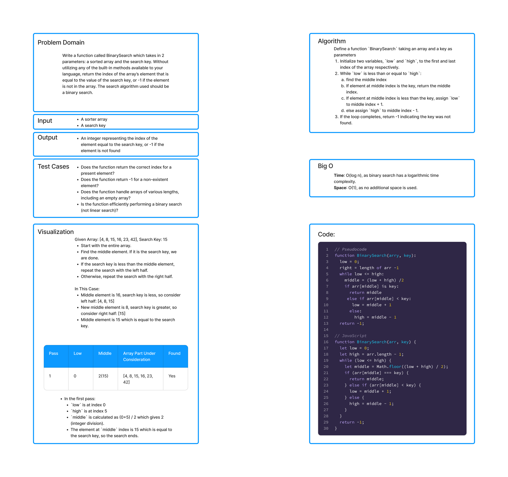

# Challenge Title

Write a function called BinarySearch which takes in 2 parameters: a sorted array and the search key. Without utilizing any of the built-in methods available to your language, return the index of the array’s element that is equal to the value of the search key, or -1 if the element is not in the array.

## Whiteboard Process

;

## Approach & Efficiency

## Approach & Efficiency

I chose the binary search algorithm for finding the index of a specific element in a sorted array. This decision is grounded in the algorithm’s efficiency, avoiding the need to traverse the entire array as in linear search, thus substantially improving search times in large datasets. Binary search works by repeatedly dividing in half the portion of the array that could contain the item, until you've narrowed down the possible locations to just one.

In this implementation, the binary search is performed iteratively, keeping track of the search space with two pointers, `low` and `high`. Initially, `low` is at the start and `high` is at the end of the array. On each step, the middle is calculated, and based on the comparison of the middle element with the search key, either the `low` is moved just past the middle, or the `high` is moved just before the middle. This process continues until the `low` pointer is less than or equal to the `high` pointer. If the element is found, the index is returned, otherwise -1 is returned indicating the absence of the element in the array.

The Big O for time complexity is O(log n) as with each step, the search space is halved. This logarithmic time complexity ensures fast execution even on large datasets. The space complexity is O(1) as no additional data structures are used, ensuring the memory footprint remains constant irrespective of the input array size.

## Solution

```js
    function BinarySearch(arr, key) {
    let low = 0;
    let high = arr.length - 1;
    while (low <= high) {
        let middle = Math.floor((low + high) / 2);
        if (arr[middle] === key) {
        return middle;
        } else if (arr[middle] < key) {
        low = middle + 1;
        } else {
        high = middle - 1;
        }
    }
    return -1;
    }
```
