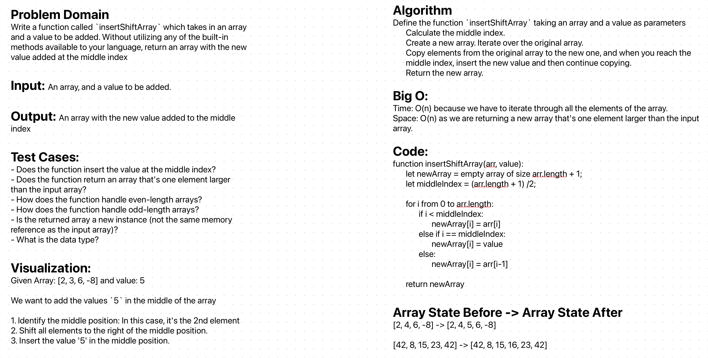

# Challenge Title

Write a function called insertShiftArray which takes in an array and a value to be added. Without utilizing any of the built-in methods available to your language, return an array with the new value added at the middle index.

## Whiteboard Process
;

## Approach & Efficiency

I chose an iterative method to insert a value into the middle of an array. Instead of using built-in methods or creating a brand new array from scratch, I took advantage of the provided array's structure. I initiated a new array with one more slot than the original to accommodate the new value. By iterating through the original array, I was able to copy its values to the new one, while making space in the center for the new value. 

The Big O for time is O(n) because we iterate through the entire length of the original array once. Even though we might perceive the process of copying to a new array as doubling the operations, this still falls under the umbrella of O(n) since constants are typically omitted in Big O notation. The space complexity is O(n) as well, because we're creating a new array that is slightly larger (by one element) than the input array. 

## Solution


```js
   function insertShiftArray(arr, value) {
    let newArray = new Array(arr.length + 1);
    let middleIndex = Math.ceil(arr.length / 2);

    for (let i = 0; i <= arr.length; i++) {
        if (i < middleIndex) {
            newArray[i] = arr[i];
        } else if (i === middleIndex) {
            newArray[i] = value;
        } else {
            newArray[i] = arr[i - 1];
        }
    }

    return newArray;
}
 
```
