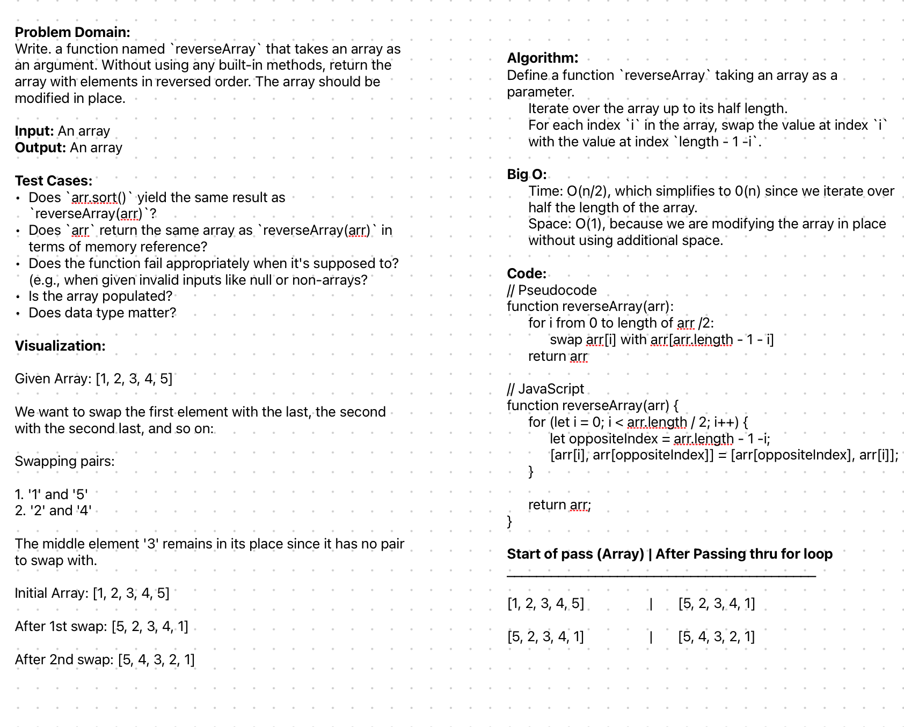

# Challenge Title

Write a function called `reverseArray` which takes an array as an argument. Without utilizing any of the built-in methods available to your language, return an array with elements in reversed order.

## Whiteboard Process
;

## Approach & Efficiency

I chose an in-place iterative approach to reverse the array. I used the inherent structure of the array and swapped outer elements moving inward. By halting the iteration at the midpoint of the array we can avoid redundant operations as the middle suggests the array is reversed. 

The Big O for time is O(n/2) which simplifies to O(n) since we iterate over half the length of the array. Space complexity is O(1) because we are modifying the array in place without using additional space. 

## Solution
To run the code, we can use any JavaScript environment. 

Here's how to use the `reverseArray` function:

```js
    function reverseArray(arr) {
    for (let i = 0; i < arr.length / 2; i++) {
        let oppositeIndex = arr.length - 1 - i;
        [arr[i], arr[oppositeIndex]] = [arr[oppositeIndex], arr[i]];
    }
    return arr;
}

// Examples:
console.log(reverseArray([1, 2, 3, 4, 5])); // Outputs: [5, 4, 3, 2, 1]
console.log(reverseArray([1, 2, 3, 4]));   // Outputs: [4, 3, 2, 1]

```