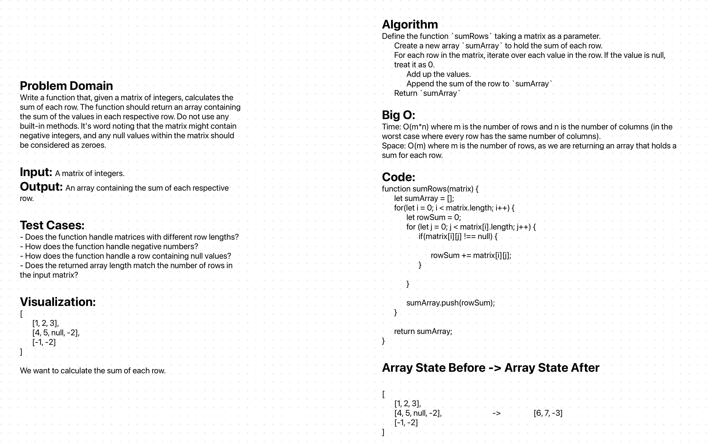

# Sum Rows of a Matrix

## Problem Domain 

Write a function that, given a matrix of integers, calculates the sum of each row. The function should return an array containing the sum of the values in each respective row. Do not use any built-in methods. It's word noting that the matrix might contain negative integers, and any null values within the matrix should be considered as zeroes. 

## Whiteboard Process
;

## Approach & Efficiency

For this challenge, I took a double iterative approach. The outer loop iterates through the rows, and the inner loop goes over each element of a particular row, summing its values. Any `null` values found within the rows are considered as zeros. The sum of each row is then stored in a results array.

## Solution 

```js

function sumRows(matrix) {
  let sumArray = [];
  for(let i = 0; i < matrix.length; i++) {
    let rowSum = 0;
    for(let j = 0; j < matrix[i].length; j++) {
      if(matrix[i][j] !== null) {
        rowSum += matrix[i][j];
      }
    }
    sumArray.push(rowSum);
  }
  return sumArray;
}

// Examples:
console.log(sumRows([
  [1, 2, 3],
  [4, 5, null, -2],
  [-1, -2]
])); // Outputs: [6, 7, -3]

console.log(sumRows([
  [1, 2, 3, 4],
  [5, 6, 7, 8]
]));   // Outputs: [10, 26]


```

