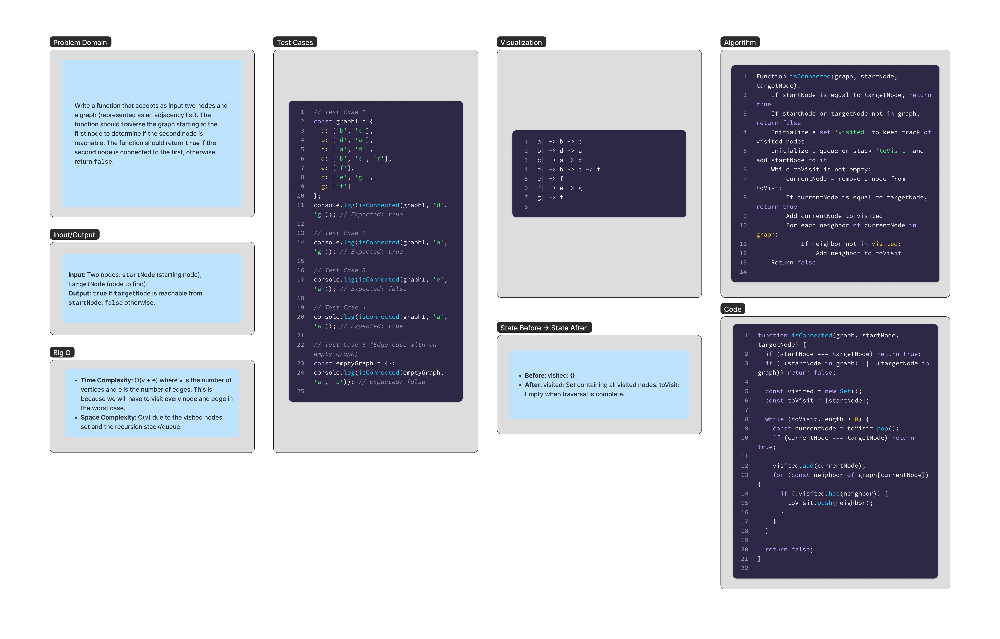

# Class 39 Challenge

Write a function that accepts as input two nodes and a graph (represented as an adjacency list). The function should traverse the graph starting at the first node to determine if the second node is reachable. The function should return true if the second node is connected to the first, otherwise return false.

## Whiteboard Process



## Approach & Efficiency

### Approach

The `isConnected` function determines if there is a path between two nodes in an undirected graph. The graph is represented as an adjacency list.

The approach uses a breadth-first search (BFS) to traverse the graph, and involves the following steps:

1. **Edge Case Handling:**

   - If `startNode` is the same as `targetNode`, return `true`.
   - If either `startNode` or `targetNode` is not in the graph, return `false`.

2. **Initialization:**

   - Create an empty set `visited` to keep track of visited nodes.
   - Initialize a stack or queue `toVisit` with the `startNode`.

3. **Breadth-First Search (BFS):**

   - While `toVisit` is not empty:
     - Pop a node from `toVisit` (using `.pop()` for DFS or `.shift()` for BFS) and assign it to `currentNode`.
     - If `currentNode` is equal to `targetNode`, return `true`.
     - Add `currentNode` to the `visited` set.
     - For each neighbor of `currentNode`:
       - If the neighbor is not in `visited`, add it to `toVisit`.

4. **Result:**
   - If the traversal completes without finding `targetNode`, return `false`.

### Efficiency

The efficiency of this solution is governed by its time and space complexity:

- **Time Complexity:**

  - The time complexity is O(V + E), where V is the number of vertices and E is the number of edges in the graph.
  - This is because the algorithm needs to visit every vertex and traverse every edge once in the worst case.

- **Space Complexity:**
  - The space complexity is O(V), where V is the number of vertices in the graph.
  - This is due to the `visited` set and the `toVisit` stack or queue, which could store up to all the vertices.

## Solution

```javascript
function isConnected(graph, startNode, targetNode) {
  if (startNode === targetNode) return true;
  if (!(startNode in graph) || !(targetNode in graph)) return false;

  const visited = new Set();
  const toVisit = [startNode];

  while (toVisit.length > 0) {
    const currentNode = toVisit.pop();
    if (currentNode === targetNode) return true;

    visited.add(currentNode);
    for (const neighbor of graph[currentNode]) {
      if (!visited.has(neighbor)) {
        toVisit.push(neighbor);
      }
    }
  }

  return false;
}
```
