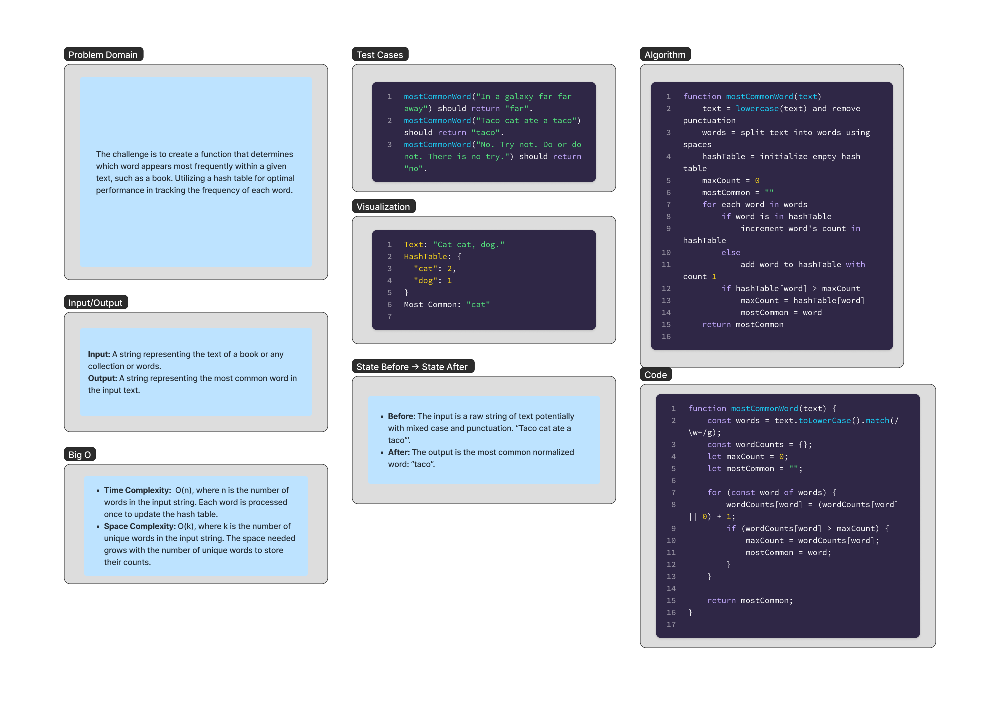

# commonWord

The challenge is to create a function that determines which word appears most frequently within a given text, such as a book. Utilizing a hash table for optimal performance in tracking the frequency of each word.


## Whiteboard Process

;

## Approach & Efficiency

### Approach


### Efficiency 
The efficiency of this solution is governed by its time and space complexity:

- **Time Complexity**: 
- **Space Complexity**: 


## Solution

```js


```
