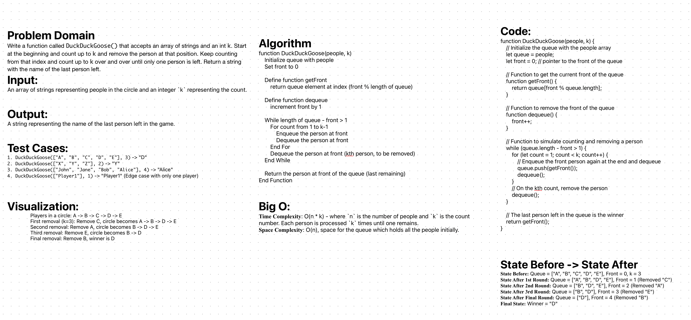

# Duck Duck Goose

Write a function called DuckDuckGoose() that accepts an array of strings and an int k. Start at the beginning and count up to k and remove the person at that position. Keep counting from that index and count up to k over and over until only one person is left. Return a string with the name of the last person left.

## Whiteboard Process

;

## Approach & Efficiency

The approach was to simulate the game using a queue data structure. The queue was implemented by using an array (`queue`) and a pointer (`front`) to represent the current front of the queue. The `getFront` function was used to access the current front element, while the `dequeue` function advanced the `front` pointer, effectively simulating the removal of a player from the game. The main while loop continues until only one player remains in the queue, with a nested for loop counting up to `k-1` and simulating the 'Duck' part of the game. On reaching `k`, the current front player is dequeued without re-adding them to the queue, effectively removing them from the game.

The time complexity of this solution is O(n * k), where `n` is the number of players and `k` is the count number, due to each player being processed up to `k` times until only one remains. The space complexity is O(n), as the queue initially holds all the players. This approach is effective for smaller values of `n` and `k`, but could become less efficient for very large numbers due to the nested loop structure. In such cases, considering alternative approaches or optimizations might be beneficial to improve efficiency.


## Solution

```js
function DuckDuckGoose(people, k) {
  let queue = people;
  let front = 0; 


  function getFront() {
    return queue[front % queue.length];
  }

  function dequeue() {
    front++;
  }

  while (queue.length - front > 1) {
    for (let count = 1; count < k; count++) {

      queue.push(getFront());
      dequeue();
    }
    
    dequeue();
  }

  
  return getFront();
}

```
