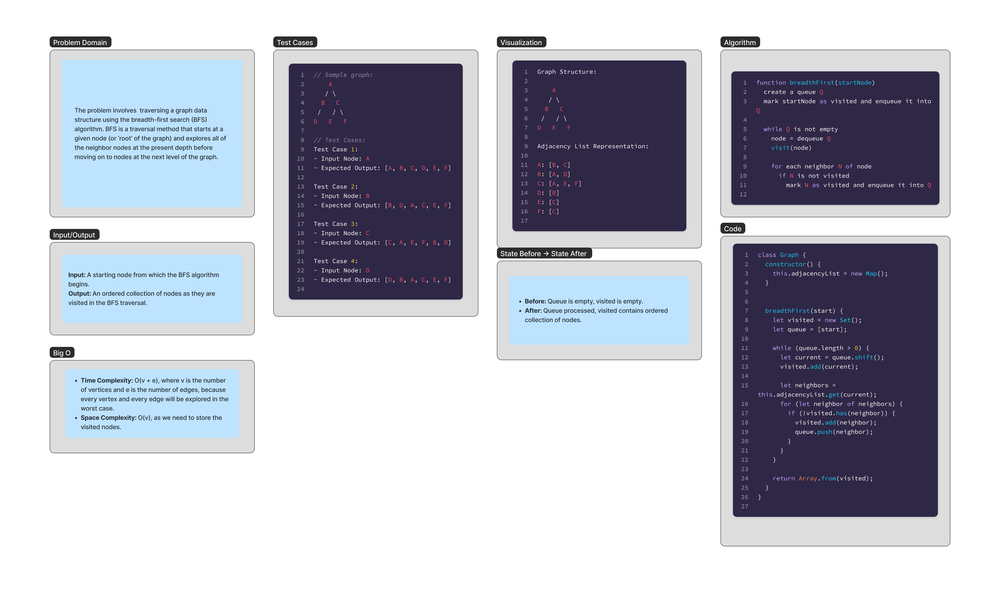

# Graph Bredth First Whiteboard 

The problem involves  traversing a graph data structure using the breadth-first search (BFS) algorithm. BFS is a traversal method that starts at a given node (or ‘root’ of the graph) and explores all of the neighbor nodes at the present depth before moving on to nodes at the next level of the graph.

## Whiteboard Process

;


## Approach & Efficiency

### Approach

The `breadthFirst` method in the `Graph` class implements the BFS algorithm using an adjacency list, which is stored as a `Map` object where each key represents a vertex and the corresponding value is a list of its neighboring vertices. 

The method starts by creating a `Set` to keep track of visited nodes and a queue initialized with the starting node. It proceeds by exploring each level of depth in the graph, visiting all neighbors of the current node before moving to the next level. For each visited node, it enqueues all unvisited neighbors to ensure they are visited in a breadth-first manner. This process repeats until the queue is empty.

### Efficiency

The efficiency of this solution is governed by its time and space complexity:

- **Time Complexity**:
  - The time complexity is O(V + E), where V is the number of vertices and E is the number of edges. This is because in the worst case, we will need to visit all vertices and traverse all edges to explore the neighbors.

- **Space Complexity**:
  - The space complexity is O(V), as in the worst case we need to hold all vertices in the visited set. 


## Solution

```js
class Graph {
  constructor() {
    this.adjacencyList = new Map();
  }
  

  breadthFirst(start) {
    let visited = new Set();
    let queue = [start];
    
    while (queue.length > 0) {
      let current = queue.shift();
      visited.add(current);
      
      let neighbors = this.adjacencyList.get(current);
      for (let neighbor of neighbors) {
        if (!visited.has(neighbor)) {
          visited.add(neighbor);
          queue.push(neighbor);
        }
      }
    }
    
    return Array.from(visited);
  }
}

```
