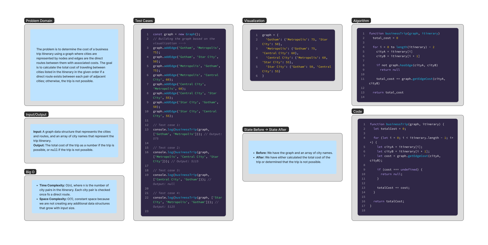

# Graph Business Trip

The problem is to determine the cost of a business trip itinerary using a graph where cities are represented by nodes and edges are the direct routes between them with associated costs. The goal is to calculate the total cost of traveling between cities listed in the itinerary in the given order if a direct route exists between each pair of adjacent cities; otherwise, the trip is not possible.


## Whiteboard Process

;


## Approach & Efficiency

### Approach

The `businessTrip` function takes a graph data structure and an array of city names (itinerary) as input. The function's goal is to calculate the total cost of the business trip by iterating through the itinerary and checking for the existence of a direct route between each pair of adjacent cities. If a direct route exists, the cost associated with that route is added to the total cost. If at any point a direct route does not exist between two adjacent cities, the function returns `null` to indicate that the trip is not possible.

The function uses the following steps:

1. Initialize a `totalCost` variable to 0.
2. Iterate through the itinerary, starting from the first city and ending at the second-to-last city.
3. For each pair of adjacent cities (`cityA` and `cityB`):
   - Check if there is a direct route between `cityA` and `cityB` using the `graph.getEdgeCost` method.
   - If a direct route exists, add the associated cost to the `totalCost` variable.
   - If a direct route does not exist, return `null` to indicate that the trip is not possible.
4. After the loop, return the `totalCost`.

### Efficiency

The efficiency of this solution is governed by its time and space complexity:

- **Time Complexity**:
  - The time complexity is O(n), where n is the number of city pairs in the itinerary. This is because the function iterates through the itinerary once, checking for the existence of a direct route between each pair of adjacent cities.

- **Space Complexity**:
  - The space complexity is O(1), as the function uses a constant amount of additional space (the `totalCost` variable) regardless of the size of the input.


## Solution

```js
function businessTrip(graph, itinerary) {
  let totalCost = 0;

  for (let i = 0; i < itinerary.length - 1; i++) {
    let cityA = itinerary[i];
    let cityB = itinerary[i + 1];
    let cost = graph.getEdgeCost(cityA, cityB);

    if (cost === undefined) {
      return null;
    }

    totalCost += cost;
  }

  return totalCost;
}


```
