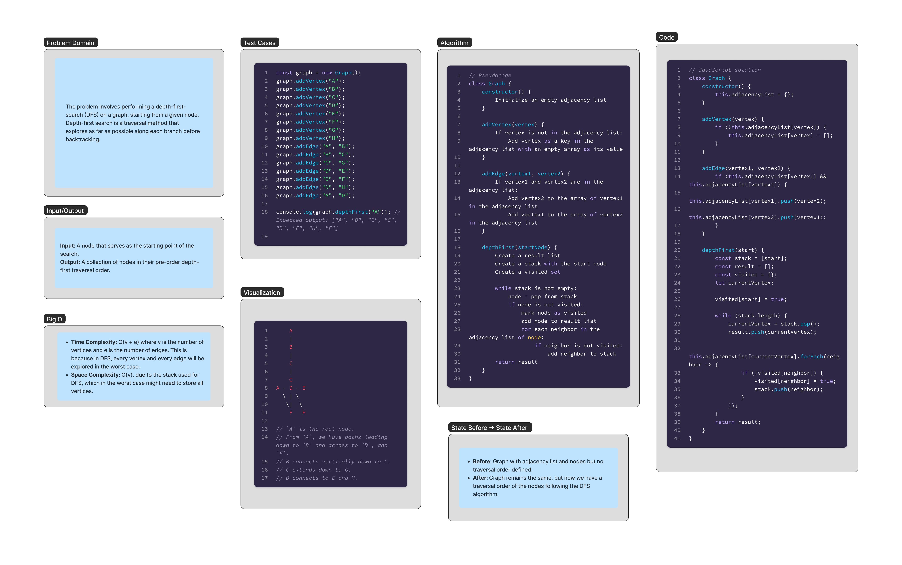

# Graph Depth First

The problem involves performing a depth-first-search (DFS) on a graph, starting from a given node. Depth-first search is a traversal method that explores as far as possible along each branch before backtracking.

## Whiteboard Process



## Approach & Efficiency

### Approach

The `Graph` class represents a graph data structure and provides methods to add vertices, add edges, and perform a depth-first search traversal.

The `constructor()` method initializes an empty adjacency list object to store the vertices and their neighboring vertices.

The `addVertex()` method adds a vertex to the graph by checking if it is not already present in the adjacency list and adding it as a key with an empty array as its value.

The `addEdge()` method adds an edge between two vertices by checking if both vertices are present in the adjacency list and adding each vertex to the array of the other vertex.

The `depthFirst()` method takes a starting node as input and performs a depth-first search traversal on the graph. It returns a collection of nodes in their pre-order depth-first traversal order.

The approach uses the following steps:

1. Create a stack and initialize it with the starting node.
2. Create a result array to store the visited nodes in their pre-order depth-first traversal order.
3. Create a visited object to keep track of visited nodes.
4. While the stack is not empty:
   - Pop a node from the stack and assign it to `currentVertex`.
   - Add `currentVertex` to the result array.
   - For each neighbor of `currentVertex` in the adjacency list:
     - If the neighbor has not been visited:
       - Mark the neighbor as visited in the visited object.
       - Push the neighbor onto the stack.
5. Return the result array containing the nodes in their pre-order depth-first traversal order.

### Efficiency

The efficiency of this solution is governed by its time and space complexity:

- **Time Complexity**:
  - The time complexity is O(v + e), where v is the number of vertices and e is the number of edges in the graph.
  - This is because in the worst case, the algorithm needs to visit every vertex and traverse every edge once.

- **Space Complexity**:
  - The space complexity is O(v), where v is the number of vertices in the graph.
  - This is due to the stack used for the depth-first search, which in the worst case might need to store all the vertices.

## Solution

```javascript
class Graph {
    constructor() {
        this.adjacencyList = {};
    }

    addVertex(vertex) {
        if (!this.adjacencyList[vertex]) {
            this.adjacencyList[vertex] = [];
        }
    }

    addEdge(vertex1, vertex2) {
        if (this.adjacencyList[vertex1] && this.adjacencyList[vertex2]) {
            this.adjacencyList[vertex1].push(vertex2);
            this.adjacencyList[vertex2].push(vertex1);
        }
    }

    depthFirst(start) {
        const stack = [start];
        const result = [];
        const visited = {};
        let currentVertex;

        visited[start] = true;

        while (stack.length) {
            currentVertex = stack.pop();
            result.push(currentVertex);

            this.adjacencyList[currentVertex].forEach(neighbor => {
                if (!visited[neighbor]) {
                    visited[neighbor] = true;
                    stack.push(neighbor);
                }
            });
        }
        return result;
    }
}
```