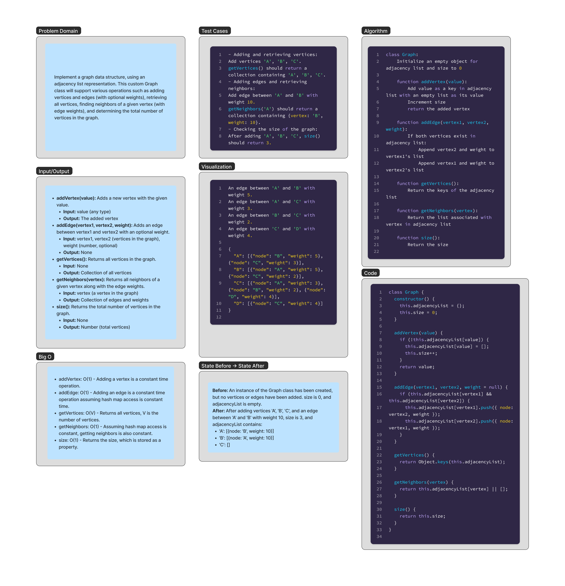

# Graph 

Implement a graph data structure, using an adjacency list representation. This custom Graph class will support various operations such as adding vertices and edges (with optional weights), retrieving all vertices, finding neighbors of a given vertex (with edge weights), and determining the total number of vertices in the graph.

## Whiteboard Process

;


## Approach & Efficiency

### Approach

The `Graph` class is implemented using an adjacency list representation. The adjacency list is stored as an object (`adjacencyList`) where each key represents a vertex, and the corresponding value is an array of its neighboring vertices along with the edge weights.

The `addVertex` method adds a new vertex to the graph by inserting it into the `adjacencyList` object with an empty array as its value. It also increments the `size` property to keep track of the number of vertices in the graph.

The `addEdge` method adds an edge between two vertices. It checks if both vertices exist in the `adjacencyList`, and if so, it appends each vertex to the other's neighboring vertices array along with the edge weight.

The `getVertices` method returns an array of all the vertices in the graph by retrieving the keys of the `adjacencyList` object.

The `getNeighbors` method returns the neighboring vertices of a given vertex along with the edge weights. It retrieves the array associated with the vertex from the `adjacencyList`.

The `size` method returns the total number of vertices in the graph, which is stored in the `size` property.

### Efficiency

The efficiency of this solution is governed by its time and space complexity:

- **Time Complexity**:
  - `addVertex`: O(1) - Adding a vertex is a constant time operation.
  - `addEdge`: O(1) - Adding an edge is a constant time operation, assuming hash map access is constant time.
  - `getVertices`: O(V) - Retrieving all vertices requires iterating over the keys of the `adjacencyList` object, where V is the number of vertices.
  - `getNeighbors`: O(1) - Retrieving the neighbors of a vertex is a constant time operation, assuming hash map access is constant time.
  - `size`: O(1) - Returning the size is a constant time operation since it is stored as a property.

- **Space Complexity**:
  - The space complexity of the graph is O(V + E), where V is the number of vertices and E is the number of edges. The `adjacencyList` object stores all the vertices and their neighboring vertices along with the edge weights.

## Solution

```js

class Graph {
  constructor() {
    this.adjacencyList = {};
    this.size = 0;
  }

  addVertex(value) {
    if (!this.adjacencyList[value]) {
      this.adjacencyList[value] = [];
      this.size++;
    }
    return value;
  }

  addEdge(vertex1, vertex2, weight = null) {
    if (this.adjacencyList[vertex1] && this.adjacencyList[vertex2]) {
      this.adjacencyList[vertex1].push({ node: vertex2, weight });
      this.adjacencyList[vertex2].push({ node: vertex1, weight });
    }
  }

  getVertices() {
    return Object.keys(this.adjacencyList);
  }

  getNeighbors(vertex) {
    return this.adjacencyList[vertex] || [];
  }

  size() {
    return this.size;
  }
}

```
