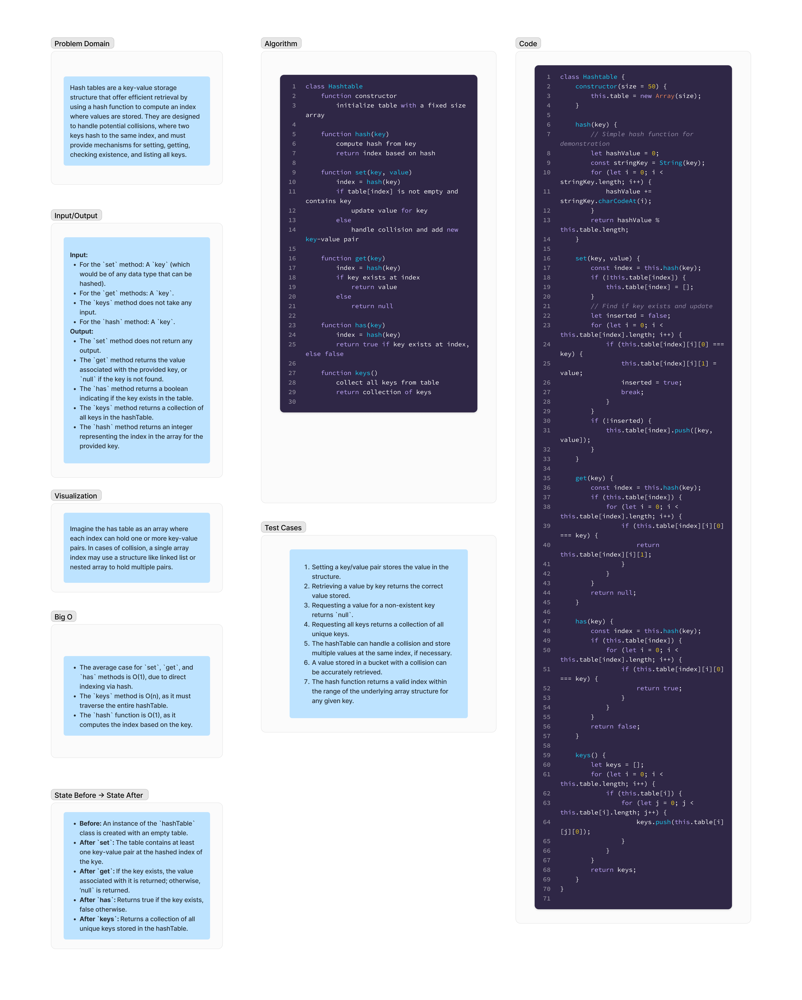

Here is the updated text inside a markdown code block:

```markdown
# Hash Tables

Hash tables are a key-value storage structure that offer efficient retrieval by using a hash function to compute an index where values are stored. They are designed to handle potential collisions, where two keys hash to the same index, and must provide mechanisms for setting, getting, checking existence, and listing all keys.  

## Whiteboard Process

;

## Approach & Efficiency

### Approach  

The implementation of the hash table involves a class `HashTable` with key methods including `set`, `get`, `has`, `keys`, and an internal `hash` function. The approach taken for each method is as follows:

- **`hash` Function**: Converts a given key into a consistent hash code, which is then mapped to an index within the table's range. This function ensures that any key is converted to a valid array index.  

- **`set` Method**: Utilizes the `hash` function to determine the index for storing the key-value pair. If the index already contains data (collision scenario), it searches for the key within the existing entries. If found, it updates the value; otherwise, it adds the new key-value pair, effectively handling collisions.

- **`get` Method**: Retrieves the value associated with a given key by computing its index using the `hash` function. It then searches through potential collisions at that index to find the matching key and return its value.  

- **`keys` Method**: Iterates through the entire hash table, collecting and returning all the keys stored within it.  

### Efficiency  

**Time Complexity**:

- The `hash` function operates in a constant time, O(1), as it performs a fixed series of operations regardless of the input size.  

- The `set`, `get`, and `has` methods ideally operate in constant time, O(1), assuming a good hash function with minimal collisions. However, in the worst-case scenario, with many collisions leading to a large number of items at the same index, these operations can degrade to O(n), where `n` here refers to the total number of key-value pairs in the table.  

**Space Complexity**:

- The hash table's space complexity is O(n), where `n` is the number of key-value pairs stored.
```

## Solution

```js
class Hashtable {
  constructor(size = 50) {
    this.table = new Array(size);
  }

  hash(key) {
    // Simple hash function for demonstration
    let hashValue = 0;
    const stringKey = String(key);
    for (let i = 0; i < stringKey.length; i++) {
      hashValue += stringKey.charCodeAt(i);
    }
    return hashValue % this.table.length;
  }

  set(key, value) {
    const index = this.hash(key);
    if (!this.table[index]) {
      this.table[index] = [];
    }
    // Find if key exists and update
    let inserted = false;
    for (let i = 0; i < this.table[index].length; i++) {
      if (this.table[index][i][0] === key) {
        this.table[index][i][1] = value;
        inserted = true;
        break;
      }
    }
    if (!inserted) {
      this.table[index].push([key, value]);
    }
  }

  get(key) {
    const index = this.hash(key);
    if (this.table[index]) {
      for (let i = 0; i < this.table[index].length; i++) {
        if (this.table[index][i][0] === key) {
          return this.table[index][i][1];
        }
      }
    }
    return null;
  }

  has(key) {
    const index = this.hash(key);
    if (this.table[index]) {
      for (let i = 0; i < this.table[index].length; i++) {
        if (this.table[index][i][0] === key) {
          return true;
        }
      }
    }
    return false;
  }

  keys() {
    let keys = [];
    for (let i = 0; i < this.table.length; i++) {
      if (this.table[i]) {
        for (let j = 0; j < this.table[i].length; j++) {
          keys.push(this.table[i][j][0]);
        }
      }
    }
    return keys;
  }
}
```
