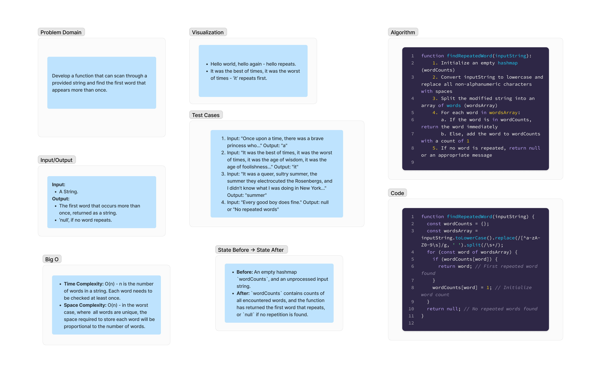

# Repeated Word

Develop a function that can scan through a provided string and find the first word that appears more than once. 

## Whiteboard Process

;

## Approach & Efficiency

### Approach
The function `findRepeatedWord` follows a straightforward approach to solve the problem of finding the first repeated word in a string. It involves preprocessing the input string to ensure uniformity (converting to lowercase and removing non-alphanumeric characters), splitting it into an array of words, and then using a hashmap to track the occurrence of each word. As the function iterates over the array of words, it checks if a word has already been encountered by looking it up in the hashmap. If a word is found in the hashmap, it is immediately returned as the first repeated word. If not, the word is added to the hashmap with a count of 1. This process continues until a repeated word is found or all words have been checked.

### Efficiency 
The efficiency of this solution is governed by its time and space complexity:

- **Time Complexity: O(n)**, where n is the number of words in the string. This is because each word in the input string needs to be checked exactly once to determine if it has been seen before. The efficiency in time comes from the hashmap's ability to perform insertions and lookups in constant time, allowing the function to process each word without needing to compare it against all others.

- **Space Complexity: O(n)**, in the worst-case scenario where all words in the input string are unique. In this case, the hashmap (`wordCounts`) will grow to store each unique word as a key, with its value being the count of occurrences (which will remain 1 for all words in this scenario). The space required by the hashmap is directly proportional to the number of unique words, hence the linear space complexity.

This approach ensures that the function is both time-efficient, due to the constant-time operations of a hashmap, and space-efficient relative to the size of the input, as it only stores information necessary to identify the first repeated word.


## Solution

```js
function findRepeatedWord(inputString) {
  const wordCounts = {};
  const wordsArray = inputString.toLowerCase().replace(/[^a-zA-Z0-9\s]/g, ' ').split(/\s+/);
  for (const word of wordsArray) {
    if (wordCounts[word]) {
      return word; // First repeated word found
    }
    wordCounts[word] = 1; // Initialize word count
  }
  return null; // No repeated words found
}

```
