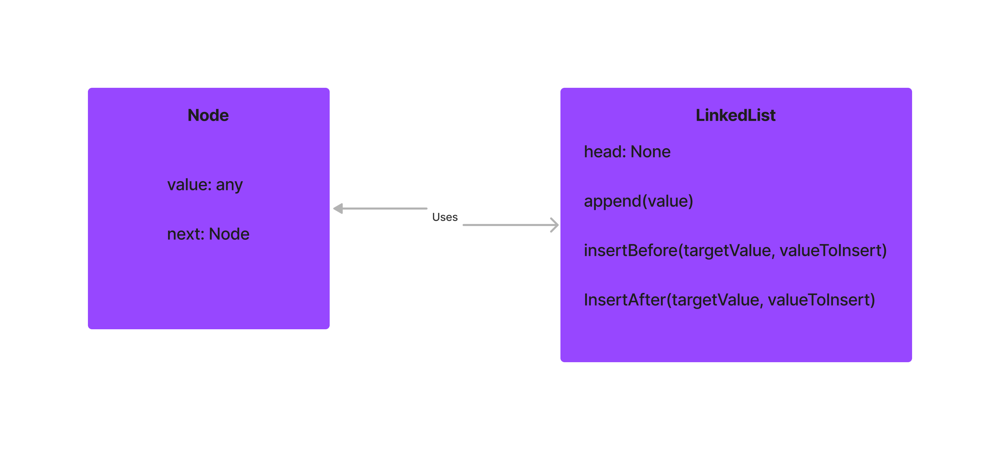

# LinkedList Insertions

In this challenge, we've implemented a singly linked list with the ability to append to the end, insert before a specific value, and insert after a specific value. This data structure and its methods are tested to ensure correct functionality, including error handling.

## Whiteboard Process

;


## Approach & Efficiency

- For the `append` method, we traverse the list to find the last node and then add a new node to the end. This operation is O(n) for time complexity, where n is the number of nodes.
  
- For the `insertBefore` and `insertAfter` methods, we also traverse the list to find the node with the target value. Once the node is found, the new node is inserted in the respective position. Both methods are O(n) for time complexity.

The space complexity for all methods is O(1) as we are only using a constant amount of space (i.e., creating a single new node).

## Solution

To run the code:
1. Import the LinkedList class from the `index.js` file.
2. Create a new LinkedList instance.
3. Use the available methods (`append`, `insertBefore`, and `insertAfter`) on the instance.

### Example:

```javascript
const { LinkedList } = require('./index');

// Create a new LinkedList instance
const ll = new LinkedList();

// Append values to the end of the list
ll.append(1);
ll.append(3);
ll.append(4);

// The current linked list is: 1 -> 3 -> 4

// Insert a value before a specific node
ll.insertBefore(3, 2);  // This will insert 2 before 3 in the list
console.log(ll.head.next.value);  // This should print 2

// The linked list becomes: 1 -> 2 -> 3 -> 4

// Insert a value after a specific node
ll.insertAfter(3, 5);  // This will insert 5 after 3 in the list
console.log(ll.head.next.next.next.value);  // This should print 5

// The final linked list is: 1 -> 2 -> 3 -> 5 -> 4
