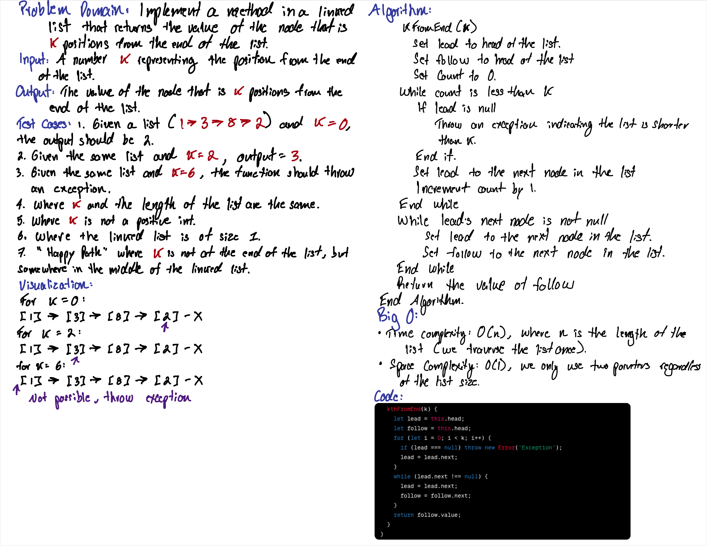

# LinkedList Kth

In this challenge, I've implemented a method in a linked list that returns the value of the node that is `k` positions from the end of the list. 


## Whiteboard Process

;


## Approach & Efficiency

The approach taken to solve this problem involves the "runner" technique, where two pointers are used to traverse the linked list. The first pointer advances through the list, and the second pointer starts moving only after the first pointer has moved `k` nodes. By the time the first pointer reaches the end, the second pointer will be at the desired position, `k` nodes from the end. This algorithm ensures that each node is visited only once, resulting in a time complexity of O(n), where `n` is the length of the list. The space complexity is O(1), as the space used does not grow with the size of the input list.

## Solution

The `KthFrontEnd` method is a part of the `LinkedList` class. The method takes an integer `k` as an argument and returns the value of the node that is `k` positions from the end of the list. If `k` is greater than or equal to the length of the list, or if `k` is negative, the method throws an error to signify invalid input.

The solution has been thoroughly tested with a series of unit tests that confirm the method's behavior in various scenarios, including edge cases.

### To run the code:

1. To use the `LinkedList` class and its `KthFrontEnd` method in a JavaScript file, first import the module with `const { LinkedList } = require('./path/to/index.js');`, then create an instance of `LinkedList`, append nodes, and use the `KthFrontEnd(k)` method as needed.
2. You can also run your JavaScript files directly with Node.js by using the command `node your-file-name.js` to see the output of your scripts in the terminal.


### Example:

Let's assume we have a linked list with node values in the order [1, 3, 8, 2]:

- For `k = 0`, the method should return the last node value, which is 2.
- For `k = 2`, the method should return the value two nodes from the end, which is 3.
- Trying to find a node more than the length of the list (e.g., `k = 6` for a list with four nodes) results in an exception, indicating that the list is too short.

Here's an example of how the `KthFrontEnd` method can be called on a LinkedList instance:

```js
const ll = new LinkedList();
ll.append(1);
ll.append(3);
ll.append(8);
ll.append(2);

// Retrieves the value 2 nodes from the end:
const kthValue = ll.KthFrontEnd(2); // Returns 3
