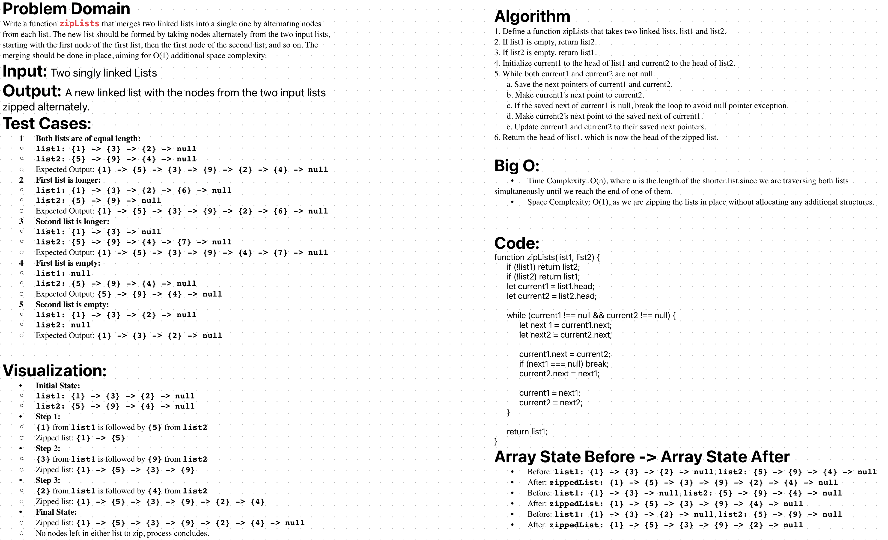

# LinkedList Zip

Write a function zipLists that merges two linked lists into a single one by alternating nodes from each list. The new list should be formed by taking nodes alternately from the two input lists, starting with the first node of the first list, then the first node of the second list, and so on. The merging should be done in place, aiming for O(1) additional space complexity.


## Whiteboard Process

The whiteboard process includes a step-by-step breakdown of the problem, the algorithm, and visual representation of the solution.



## Approach & Efficiency

The approach taken for this problem is to iterate through both lists simultaneously, alternating between nodes from each list. This method ensures that the space complexity remains O(1), as it only rearranges the existing nodes without creating any new nodes or data structures. The time complexity is O(n), where n is the length of the shorter list, as the function iterates through both lists in parallel until the end of one is reached.

## Solution

The solution consists of the `LinkedList` class to create and manage linked lists and the `zipLists` function to merge two instances of these lists.

### To run the code:

1. Clone the repository to your local machine.
2. Navigate to the `linkedListZip` directory.
3. Run the file using Node.js:
   `node index.js`


### Example:


```js
const { LinkedList } = require('./linkedList');
const zipLists = require('./zipLists');

let list1 = new LinkedList();
let list2 = new LinkedList();

// Populate the lists
[1, 3, 2].forEach(elem => list1.append(elem));
[5, 9, 4].forEach(elem => list2.append(elem));

// Zip the lists
let zippedList = zipLists(list1, list2);

// Function to print the list
function printList(list) {
    let current = list.head;
    while (current) {
        process.stdout.write(`${current.value} -> `);
        current = current.next;
    }
    console.log('null');
}

// Print the zipped list
printList(zippedList);

```
