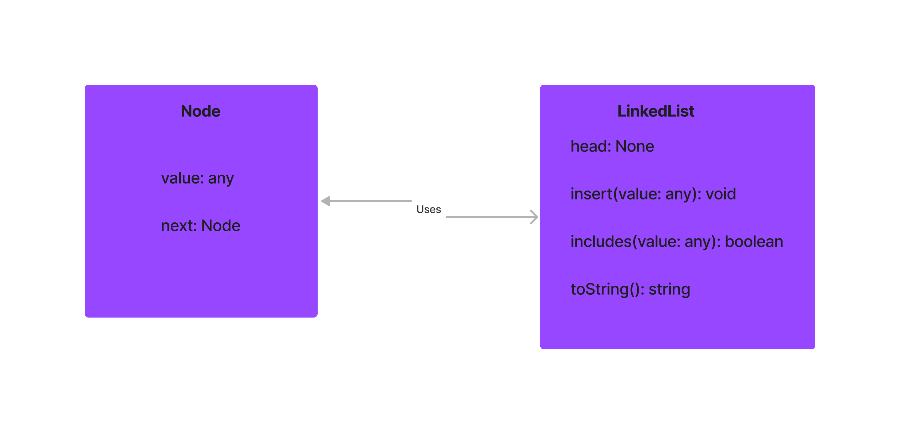

# Challenge Title

Implement a Singly Linked List data structure. This LinkedList should be able to insert values, check if it includes a value, and represent itself as a string.

## Whiteboard Process
;

## Approach & Efficiency

I approached the implementation of the LinkedList by first ensuring the fundamental building block, the Node, was in place. After that, I focused on the LinkedList class itself.

For the insert method, I opted for an O(1) time performance by always adding to the head of the list. This ensures that no matter the size of the LinkedList, the time it takes to insert a new node remains constant.

The includes method traverses the list, so its worst-case time complexity is O(n), where n is the number of nodes in the list.

Similarly, the toString method has a time complexity of O(n) since it iterates over the list to generate the string representation.

Space complexity across these methods remains O(1), as we're not creating any new data structures that grow with input size.

## Solution

To work with the LinkedList, instantiate it and use its methods as demonstrated: 

```js
const LinkedList = require('./path-to-your-linked-list-file'); // Ensure to update the path

const list = new LinkedList();

// Inserting values
list.insert('apple');
list.insert('banana');
list.insert('cherry');

// Checking inclusion
console.log(list.includes('apple'));   // Outputs: true
console.log(list.includes('orange'));  // Outputs: false

// String representation
console.log(list.toString());  // Outputs: "{ cherry } -> { banana } -> { apple } -> NULL"

```
