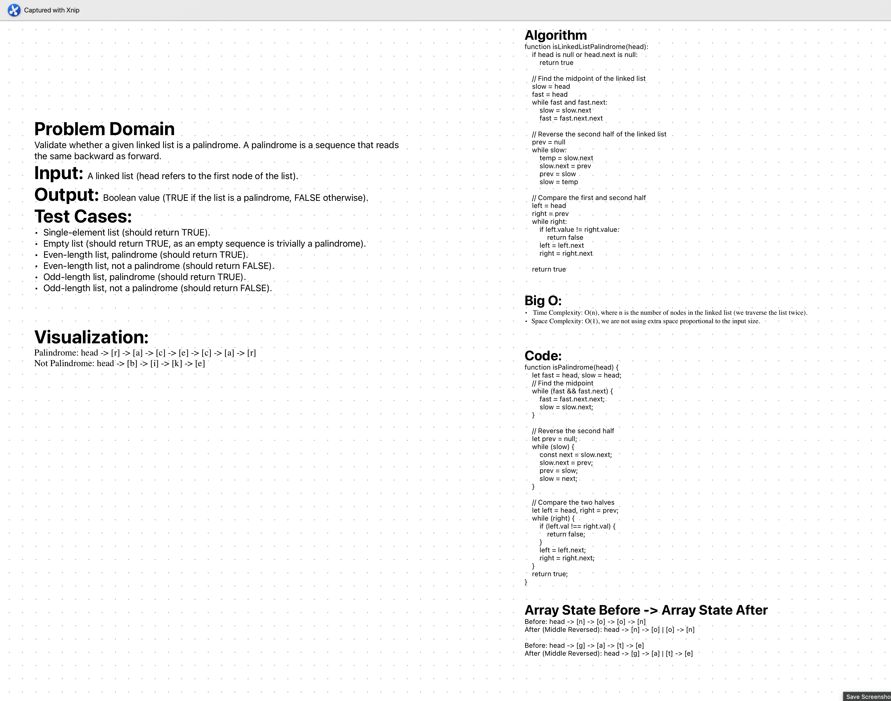

# Challenge Title

Write a function called isPalindrome which takes the head of a linked list as an argument. Without utilizing any of the built-in methods available in your language, return a boolean indicating whether the linked list is a palindrome.


## Whiteboard Process
;

## Approach & Efficiency

I adopted a two-pointer technique to determine if the linked list is a palindrome. The approach involves finding the middle of the list, reversing the second half, and then comparing it with the first half. This method ensures that we only traverse the list twice, thus optimizing the time complexity.

The Big O for time is O(n), where n is the number of nodes in the linked list, as we may potentially check each element once. The space complexity is O(1) since the list is modified in place and no additional space that scales with the input size is used.


## Solution
To run the code, any JavaScript environment like Node.js or browser consoles can be used.

Here's how to use the `isPalindrome` function:
```js
function isPalindrome(head) {
    if (!head || !head.next) {
        return true;
    }

    let fast = head, slow = head;
    // Find the midpoint
    while (fast && fast.next) {
        fast = fast.next.next;
        slow = slow.next;
    }
    
    // Reverse the second half
    let prev = null;
    while (slow) {
        const next = slow.next;
        slow.next = prev;
        prev = slow;
        slow = next;
    }
    
    // Compare the two halves
    let left = head, right = prev;
    while (right) {
        if (left.val !== right.val) {
            return false;
        }
        left = left.next;
        right = right.next;
    }
    return true;
}

// Example usage:
// Assuming 'Node' is a class that creates a new node with 'val' and 'next' properties
// Assuming 'head' is the first node of your linked list
console.log(isPalindrome(head)); // Outputs: true or false based on the linked list

```