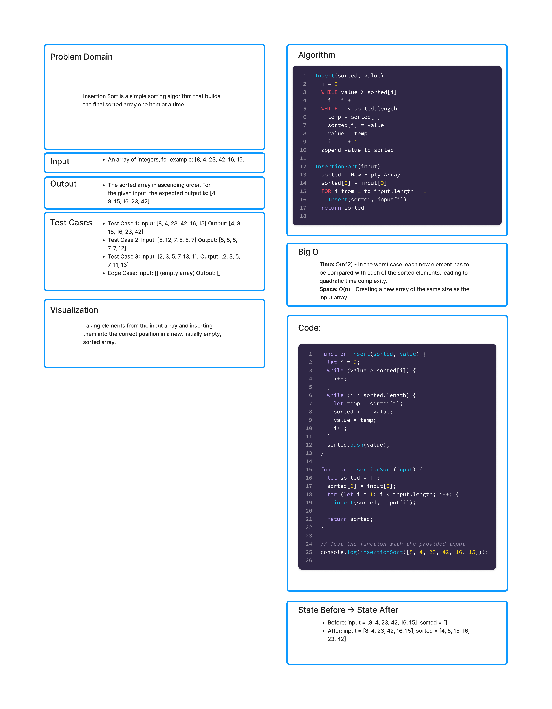

# Insertion Sort

Insertion Sort is a simple sorting algorithm that builds the final sorted array one item at a time. This method works similarly to the way you might sort playing cards in your hands. It is best used on small or mostly sorted datasets. The algorithm iterates thorugh an input list, removing one element per iteartion, and finding the place it belongs in a growing sorted list. This sorting method is efficient for small data sets and is stable, meaning that it preserves the relative order of equal elements. 

## Article
[Insertion Sort In-Depth Breakdown](./insertionSort.md);

## Whiteboard Process
;


## Approach & Efficiency

### Approach 
- **Initialization**: We start with a `sorted` array that initially contsins the first element of the `input` array. 
- **isnertion**: In each iteration, we take the next element from the `input` array and insert it into the correct position in the `sorted` array. This is done by shifting elements in the `sorted` array to make room for the new element. 
- **Completion**: The process repeats until all elements from the `input` array have been inserted into the `sorted` array. 

### Efficiency 
- **Time Complexity**: O(n^2), where `n` is the number of elements in the input array. In the worst-case scenerio, each insertion operation requires comparing the element with each of the already sorted elements, leading to quadratic time complexity. 
- **Space Complexity**: O(n), as we are creating a new array of the same size as the input array. The space required by the algorithm is proportional to the input size. 

## Solution

```js
function insert(sorted, value) {
  let i = 0;
  while (value > sorted[i]) {
    i++;
  }
  while (i < sorted.length) {
    let temp = sorted[i];
    sorted[i] = value;
    value = temp;
    i++;
  }
  sorted.push(value);
}

function insertionSort(input) {
  let sorted = [];
  sorted[0] = input[0];
  for (let i = 1; i < input.length; i++) {
    insert(sorted, input[i]);
  }
  return sorted;
}

// Test the function with the provided input
console.log(insertionSort([8, 4, 23, 42, 16, 15]));

  
