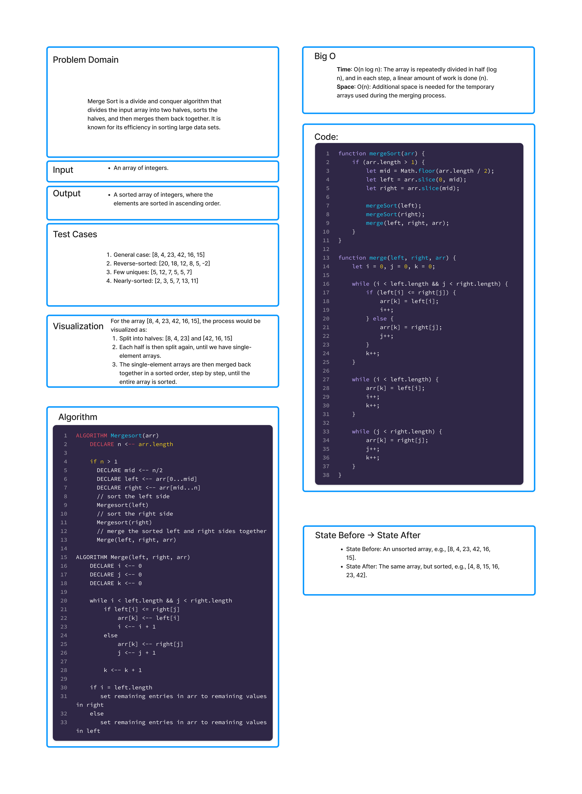

# Merge Sort
Merge Sort is a divide and conquer algorithm that divides the input array into two halves, sorts the halves, and then merges them back together. It is known for its efficiency in sorting large data sets.

## Article
[Merge Sort In-Depth Breakdown](./mergeSort.md)

## Whiteboard Process



## Approach & Efficiency

### Approach 


### Efficiency 

## Solution

```js

  
