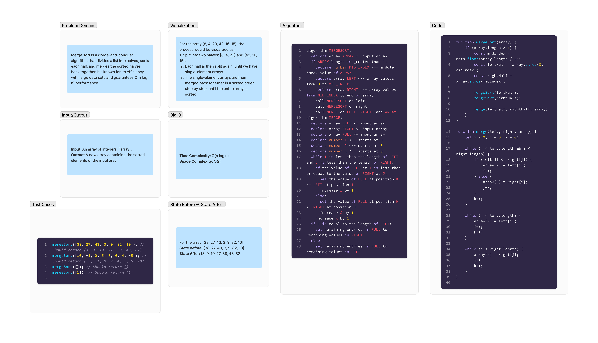

# Mock Merge Sort

Merge sort is a divide-and-conquer algorithm that divides a list into halves, sorts each half, and merges the sorted halves back together. It's known for its efficiency with large data sets and guarantees O(n log n) performance.

## Whiteboard Process



## Approach & Efficiency

### Approach

The approach for the merge sort is divided into two main functions:

- **Divide**: The `mergeSort` function recursively splits the input array in half until subarrays contain only one element.

- **Conquer and Combine**: The `merge` function then takes over to conquer by sorting and combining the elements from the subarrays into a sorted array.

### Efficiency

- **Time Complexity**: O(n log n), where `n` is the number of elements in the input array. This complexity arises from the need to split the array into halves (log n operations) and then merge arrays (n operations).

- **Space Complexity**: O(n), as the algorithm allocates additional space for the left and right subarrays. The amount of memory used is proportional to the size of the input array.

## Solution

```js
function mergeSort(arr) {
  if (arr.length > 1) {
    let mid = Math.floor(arr.length / 2);
    let left = arr.slice(0, mid);
    let right = arr.slice(mid);

    mergeSort(left);
    mergeSort(right);
    merge(left, right, arr);
  }
}

function merge(left, right, arr) {
  let i = 0,
    j = 0,
    k = 0;

  while (i < left.length && j < right.length) {
    if (left[i] <= right[j]) {
      arr[k] = left[i];
      i++;
    } else {
      arr[k] = right[j];
      j++;
    }
    k++;
  }

  while (i < left.length) {
    arr[k] = left[i];
    i++;
    k++;
  }

  while (j < right.length) {
    arr[k] = right[j];
    j++;
    k++;
  }
}

// Example usage
const array = [12, 11, 13, 5, 6, 7];
mergeSort(array);
console.log("Sorted array is: ", array);
```
