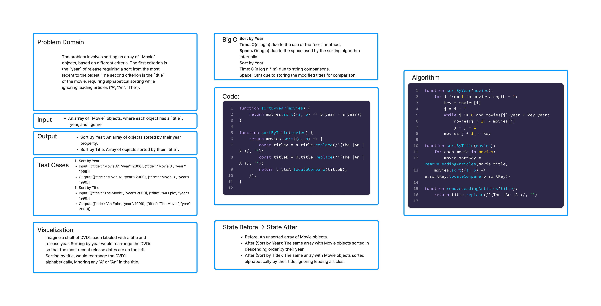

# Sorting Objects

The problem involves sorting an array of `Movie` objects, based on different criteria. The first criterion is the `year` of release requiring a sort from the most recent to the oldest. The second criterion is the `title` of the movie, requiring alphabetical sorting while ignoring leading elements (“A”, “An”).

## Whiteboard Process



## Approach & Efficiency

### Approach 

The sorting is achieved through two main functions:

1. **Sort by Year**: This function sorts movies based on their release year, with the most recent movies first.
   
2. **Sort by Title**: This function sorts movies alphabetically by their titles, ignoring leading elements to mimic a more natural sorting that might be found in a library or a movie database.

### Efficiency 

- **Sort by Year**:
  - **Time Complexity**: O(n log n) due to the use of the built-in sort method.
  - **Space Complexity**: O(log n) due to the internal space used by the sorting algorithm.

- **Sort by Title**:
  - **Time Complexity**: O(n log n * m), where `n` is the number of movies and `m` is the length of the longest movie title, due to the need for string comparison during sorting.
  - **Space Complexity**: O(n) for storing the modified titles during the sorting process.


## Solution

```js
function sortByYear(movies) {
    return movies.sort((a, b) => b.year - a.year);
}

function sortByTitle(movies) {
    return movies.sort((a, b) => {
        const titleA = a.title.replace(/^(The |An |A )/, '');
        const titleB = b.title.replace(/^(The |An |A )/, '');
        return titleA.localeCompare(titleB);
    });
}
```

// Example Usage

```js
const movies = [
    { title: "The Shawshank Redemption", year: 1994, genres: ["Drama"] },
    { title: "An Epic", year: 1975, genres: ["Adventure", "Drama"] }
];

console.log("Sorted by Year:");
console.log(sortByYear(movies));

console.log("Sorted by Title:");
console.log(sortByTitle(movies));


