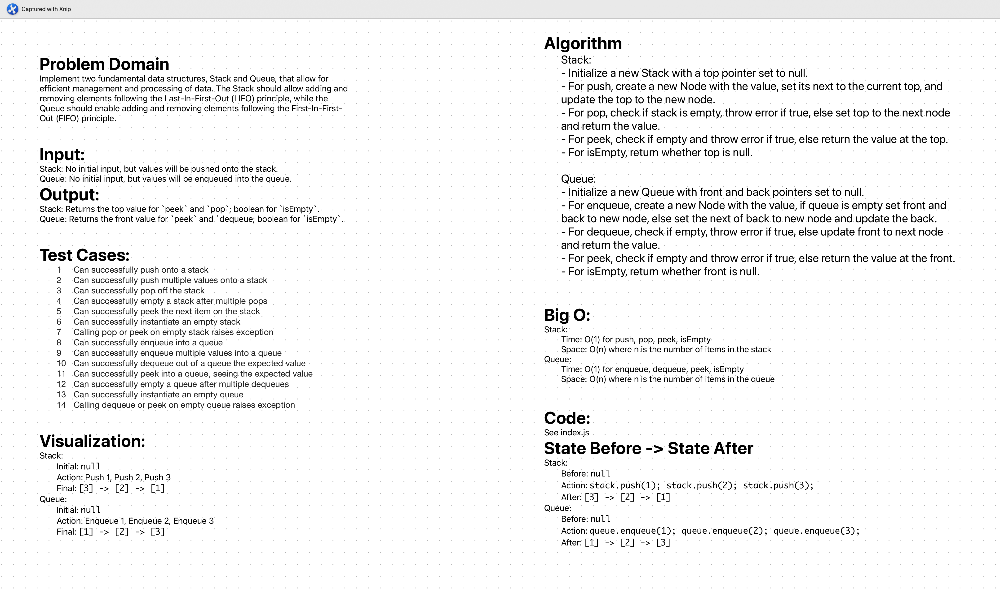

# Stack & Queue

Implement two fundamental data structures, Stack and Queue, that allow for efficient management and processing of data. The Stack should allow adding and removing elements following the Last-In-First-Out (LIFO) principle, while the Queue should enable adding and removing elements following the First-In-First-Out (FIFO) principle.


## Whiteboard Process
;

## Approach & Efficiency

The implementation of the Stack and Queue data structures utilizes a linked list approach, ensuring efficient performance. The Stack operations (push, pop, peek) are all achieved in O(1) time complexity. The push operation adds a new element at the top, while pop removes from the top, and peek returns the top element without removal. For the Queue, the enqueue and dequeue operations also operate in O(1) time complexity. Enqueue adds an element to the back of the queue, and dequeue removes from the front. This efficiency is crucial for operations where time complexity is a significant factor. Both structures are designed with an `isEmpty` method to quickly check whether the stack or queue is empty, providing a robust and efficient solution for data handling.

## Solution

```js
'use strict';

class Node {
  constructor(value) {
    this.value = value;
    this.next = null;
  }
}

class Stack {
  constructor() {
    this.top = null;
  }

  push(value) {
    const newNode = new Node(value);
    newNode.next = this.top;
    this.top = newNode;
  }

  pop() {
    if (this.isEmpty()) {
      throw new Error('Stack is empty');
    }
    const poppedValue = this.top.value;
    this.top = this.top.next;
    return poppedValue;
  }

  peek() {
    if (this.isEmpty()) {
      throw new Error('Stack is empty');
    }
    return this.top.value;
  }

  isEmpty() {
    return this.top === null;
  }
}

class Queue {
  constructor() {
    this.front = null;
    this.back = null;
  }

  enqueue(value) {
    const newNode = new Node(value);
    if (this.isEmpty()) {
      this.front = this.back = newNode;
    } else {
      this.back.next = newNode;
      this.back = newNode;
    }
  }

  dequeue() {
    if (this.isEmpty()) {
      throw new Error('Queue is empty');
    }
    const dequeuedValue = this.front.value;
    this.front = this.front.next;
    if (this.front === null) {
      this.back = null;
    }
    return dequeuedValue;
  }

  peek() {
    if (this.isEmpty()) {
      throw new Error('Queue is empty');
    }
    return this.front.value;
  }

  isEmpty() {
    return this.front === null;
  }
}

module.exports = { Node, Stack, Queue };

```