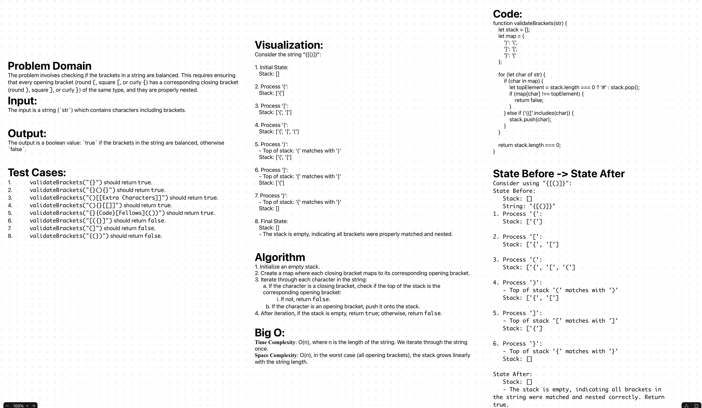

# Stack-Queue-Brackets
Create a function called `validateBrackets` to validate whether the brackets in a given string are balanced. The function should handle round, square, and curly brackets.

## Whiteboard Process
;

## Approach & Efficiency

The `validateBrackets` function utilizes a stack to keep track of the opening brackets in the string. This approach is effective for ensuring that each closing bracket corresponds to the correct opening bracket in a last-in-first-out manner.

**Algorithm Overview**:
- Traverse the string character by character.
- If an opening bracket is encountered, push it onto the stack.
- If a closing bracket is encountered, check if it matches the top element of the stack:
  - If it doesn't match or the stack is empty, return `false`.
- If the end of the string is reached and the stack is empty, return `true`; otherwise, return `false`.

**Efficiency**:
- **Time Complexity**: O(n), where n is the length of the string. The function traverses the string once.
- **Space Complexity**: O(n) in the worst case (all opening brackets) since the stack size can grow up to the length of the string.

## Solution

```js
function validateBrackets(str) {
    let stack = [];
    let map = {
        ')': '(',
        ']': '[',
        '}': '{'
    };

    for (let char of str) {
        if (char in map) {
            let topElement = stack.length === 0 ? '#' : stack.pop();
            if (map[char] !== topElement) {
                return false;
            }
        } else if ('({['.includes(char)) {
            stack.push(char);
        }
    }

    return stack.length === 0;
}

module.exports = validateBrackets;
