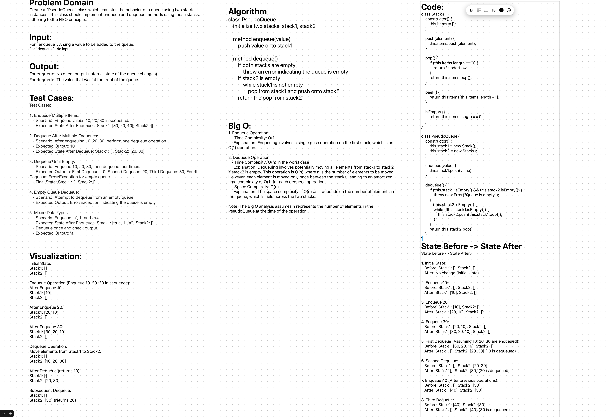

# Stack-Queue-Pseudo

Create a `PseudoQueue` class which emulates the behavior of a queue using two stack instances. This class should implement enqueue and dequeue methods using these stacks, adhering to the FIFO principle. 

## Whiteboard Process
;

## Approach & Efficiency

The `PseudoQueue` class utilizes two stacks to emulate queue functionality. This unique structure allows first-in-first-out behavior using only last-in-first-out stack operations.

**Enqueueing Elements**: New elements are enqueued by pushing onto the primary stack. As a single stack operation, this achieves O(1) time complexity.

**Dequeueing Elements**: Dequeuing involves first checking if the secondary stack is empty. If so, all elements are popped off the primary stack and pushed onto the secondary stack, reversing their order. This ensures the oldest element is at the top of the secondary stack, ready for dequeuing. In the worst case, dequeuing has O(n) time complexity where n is the number of queued elements. However, as elements move between stacks only once, the amortized complexity per operation is O(1).
The overall space complexity is O(n) since all elements are stored across the two stacks. This dual-stack model efficiently emulates queuing despite relying solely on stack operations, making it suitable when queue behavior is needed but only stacks are available.

## Solution

```js
'use strict';

class Stack {
    constructor() {
        this.items = [];
    }

    push(element) {
        this.items.push(element);
    }

    pop() {
        if (this.items.length === 0) {
            throw new Error("Stack underflow");
        }
        return this.items.pop();
    }

    peek() {
        if (this.items.length === 0) {
            return null;
        }
        return this.items[this.items.length - 1];
    }

    isEmpty() {
        return this.items.length === 0;
    }
}

class PseudoQueue {
    constructor() {
        this.stack1 = new Stack();
        this.stack2 = new Stack();
    }

    enqueue(value) {
        this.stack1.push(value);
    }

    dequeue() {
        if (this.stack2.isEmpty()) {
            while (!this.stack1.isEmpty()) {
                this.stack2.push(this.stack1.pop());
            }
        }
        if (this.stack2.isEmpty()) {
            throw new Error("Queue is empty");
        }
        return this.stack2.pop();
    }
}

module.exports = { Stack, PseudoQueue };
