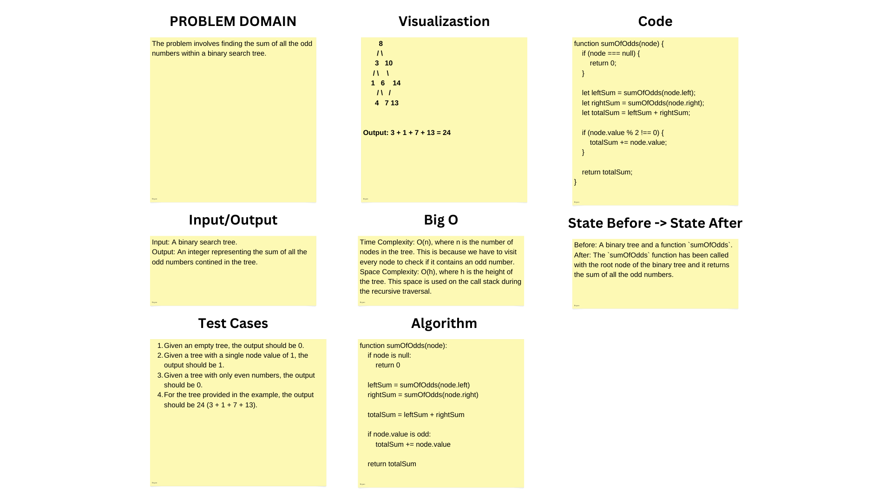

# Challenge Title

The problem involves finding the sum of all the odd numbers within a binary search tree.

## Whiteboard Process

;

## Approach & Efficiency

The approach taken to solve the problem of finding the sum of all the odd numbers within a binary search tree is a depth-first search (DFS) traversal. This method ensures that each node is visited exactly once. The traversal is done recursively, with the base case being the encounter of a null node, which contributes 0 to the sum.

At each node, the function calls itself on the left and right children, accumulating their results. It then checks if the current node's value is odd. If it is, the value is added to the total sum of odd numbers. The total sum is then returned up the call stack, combining the sums from the left and right subtrees and the current node if it's odd.

### Efficiency
- **Time Complexity:** O(n), where n is the number of nodes in the tree. This is because we have to visit every node to check if it contains an odd number. 

- **Space Complexity:** O(h), where h is the height of the tree. This space is used on the call stack during the recursive traversal. 


## Solution

```js
function sumOfOdds(node) {
  if (node === null) {
    return 0;
  }

  let leftSum = sumOfOdds(node.left);
  let rightSum = sumOfOdds(node.right);
  let totalSum = leftSum + rightSum;

  if (node.value % 2 !== 0) {
    totalSum += node.value;
  }

  return totalSum;
}
```
