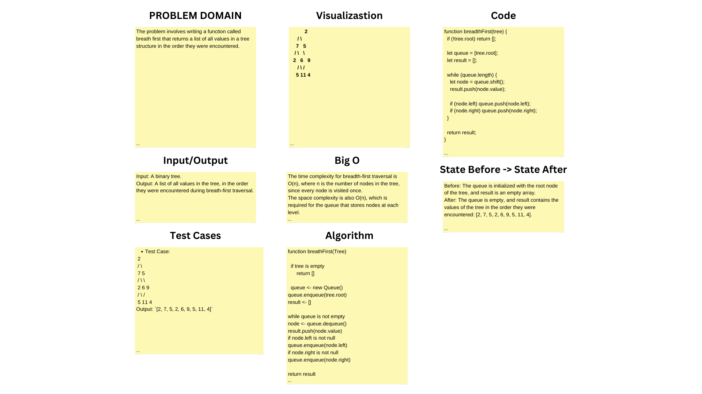

# Tree Breath First

The problem involves writing a function called breath first that returns a list of all values in a tree structure in the order they were encountered. 

## Whiteboard Process
;

## Approach & Efficiency

### Approach 
The approach is to iteratively explore the tree level by level, starting from the root and moving downwards all the levels, from left to right. A queue is employed to keep track of the nodes at the current level and ensure that they are visited in the correct order. As each node is visited, its value is added to the result list, and its child nodes are added to the queue, thus preparing the next level of nodes to be visited. 

### Efficiency
- **Time Complexity**:  The time complexity for the breadthFirst function is O(n), where n is the number of nodes in the binary tree. This is because every node in the tree is visited exactly once.
- **Space Complexity**: The space complexity is also O(n), which accounts for the worst-case scenario where the queue contains all the nodes at the widest level of the tree. 

## Solution

```js
breadthFirst() {
    if (!this.root) return [];

    let queue = [this.root];
    let result = [];

    while (queue.length) {
      let node = queue.shift();
      result.push(node.value);

      if (node.left) queue.push(node.left);
      if (node.right) queue.push(node.right);
    }

    return result;
  }
```