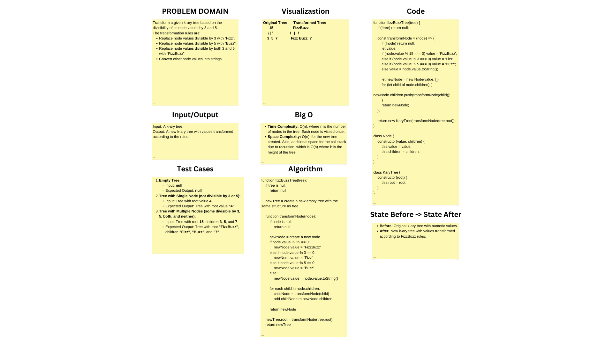

# Tree Breath First

## Problem Domain

Transform a given k-ary tree based on the divisibility of its node values by 3 and 5.
The transformation rules are:
Replace node values divisible by 3 with "Fizz".
Replace node values divisible by 5 with "Buzz".
Replace node values divisible by both 3 and 5 with "FizzBuzz".
Convert other node values into strings.

## Whiteboard Process

;

## Approach & Efficiency

The approach to solving the "Tree Fizz Buzz" problem involves a modification of a given k-ary tree based on the divisibility of its node values by 3 and 5. The solution is implemented in the `fizzBuzzTree` method of the `KaryTree` class. This method applies a transformation to each node in the tree and constructs a new tree with the transformed values.

### Approach
- The `fizzBuzzTree` method operates on the `KaryTree` instance it is called upon. It uses a helper function `transformNode` to apply the transformation rules to each node recursively.


### Efficiency
- **Time Complexity: O(n)**, where n is the number of nodes in the tree. Each node in the tree is visited exactly once, making the time complexity linear in relation to the number of nodes.
- **Space Complexity: O(n)**, as a new tree of the same size as the original is created. The space used is proportional to the number of nodes in the tree. Additionally, the recursive nature of the solution incurs a call stack space, which in the worst case (a degenerate tree) could be O(n), but for a balanced tree, it would be O(log n).
  
The solution is efficient in terms of both time and space complexity, ensuring that each node is processed only once and that the space used is proportional to the input size.


## Solution

```js
fizzBuzzTree() {
    const transformNode = (node) => {
      if (!node) return null;

      let value;
      if (node.value % 15 === 0) value = 'FizzBuzz';
      else if (node.value % 3 === 0) value = 'Fizz';
      else if (node.value % 5 === 0) value = 'Buzz';
      else value = node.value.toString();

      let newNode = new Node(value);
      newNode.children = node.children.map(transformNode);
      return newNode;
    };

    return new KaryTree(transformNode(this.root));
  }
```
