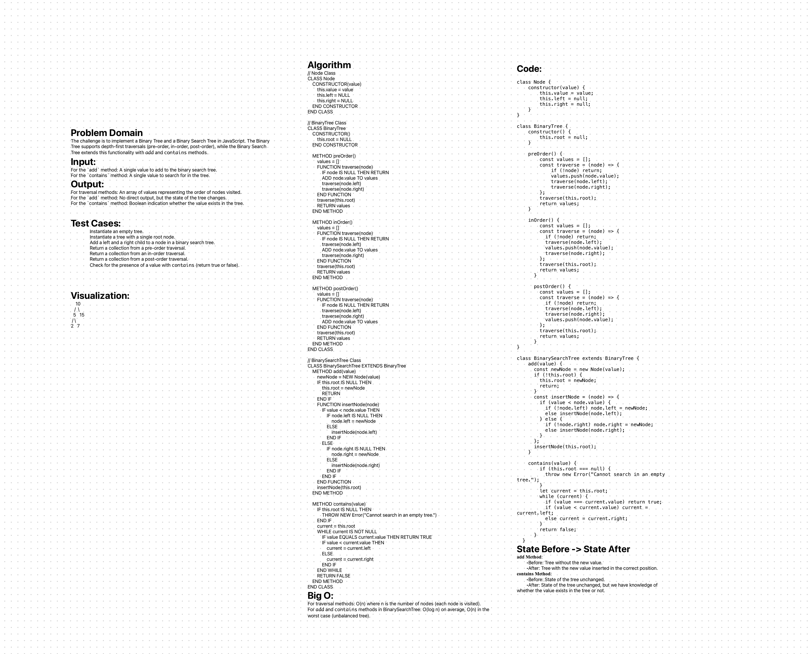

# Trees Challenge

This project implements fundamental data structures in JavaScript: Binary Trees and Binary Search Trees. It includes a `Node` class, a `BinaryTree` class with depth-first traversal methods, and a `BinarySearchTree` class that extends `BinaryTree` with additional functionalities.

## Whiteboard Process
;


## Approach & Efficiency

The implementation focuses on the Single-responsibility principle, ensuring that each method serves a singular purpose and is abstract enough to be reusable. The `BinarySearchTree` leverages the structure of the `BinaryTree` class and adds specific functionalities conforming to the BST properties.


## Solution

```js
'use strict';

class Node {
    constructor(value) {
        this.value = value;
        this.left = null;
        this.right = null;
    }
}

class BinaryTree {
    constructor() {
        this.root = null;
    }

    preOrder() {
        const values = [];
        const traverse = (node) => {
            if (!node) return;
            values.push(node.value);
            traverse(node.left);
            traverse(node.right);
        };
        traverse(this.root);
        return values;
    }

    inOrder() {
        const values = [];
        const traverse = (node) => {
          if (!node) return;
          traverse(node.left);
          values.push(node.value);
          traverse(node.right);
        };
        traverse(this.root);
        return values;
      }

      postOrder() {
        const values = [];
        const traverse = (node) => {
          if (!node) return;
          traverse(node.left);
          traverse(node.right);
          values.push(node.value);
        };
        traverse(this.root);
        return values;
      }
}

class BinarySearchTree extends BinaryTree {
    add(value) {
      const newNode = new Node(value);
      if (!this.root) {
        this.root = newNode;
        return;
      }
      const insertNode = (node) => {
        if (value < node.value) {
          if (!node.left) node.left = newNode;
          else insertNode(node.left);
        } else {
          if (!node.right) node.right = newNode;
          else insertNode(node.right);
        }
      };
      insertNode(this.root);
    }
  
    contains(value) {
        if (this.root === null) {
          throw new Error("Cannot search in an empty tree.");
        }
        let current = this.root;
        while (current) {
          if (value === current.value) return true;
          if (value < current.value) current = current.left;
          else current = current.right;
        }
        return false;
      }
  }

  module.exports = {
    BinaryTree, BinarySearchTree, Node
  }
  
