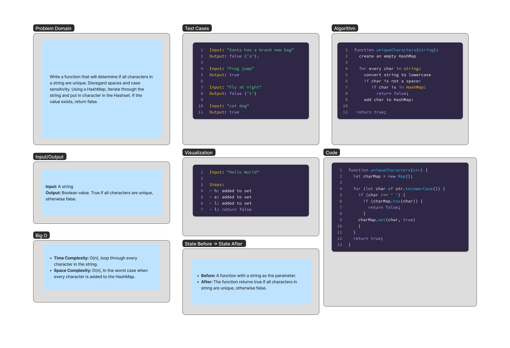

# UniqueCharacters 

Write a function that will determine if all characters in a string are unique. Disregard spaces and case sensitivity. Using a HashMap, iterate through the string and put in character in the Hashset. If the value exists, return false.


## Whiteboard Process

;


## Approach & Efficiency

### Approach

The `uniqueCharacters` function utilizes a HashMap to efficiently track the characters that have been encountered in the string. It iterates through each character of the input string, converting it to lowercase to ensure case insensitivity and ignoring spaces. For each character, it checks if that character already exists in the HashMap. If it does, the function immediately returns false, indicating that not all characters are unique. If the character is not found in the HashMap, it is added with a value indicating its presence. This approach allows the function to terminate as soon as a duplicate character is found, making it highly efficient for strings with early duplicates.

### Efficiency 

The efficiency of this solution is governed by its time and space complexity:

- **Time Complexity**: O(n), where n is the length of the string. In the worst case, the function iterates through each character of the string once. The operation of checking for the existence of a character in the HashMap and adding a new character to the HashMap can be considered O(1), making the overall time complexity linear with respect to the length of the string.

- **Space Complexity**: O(c), where c is the number of unique characters in the string. The space complexity is determined by the size of the HashMap used to track unique characters. In the worst-case scenario, where all characters are unique and ignoring spaces, this would be linear with respect to the number of unique characters. 

## Solution

```js

function uniqueCharacters(str) {
  let charMap = new Map();
  
  for (let char of str.toLowerCase()) {
    if (char !== ' ') {
      if (charMap.has(char)) {
        return false;
      }
    charMap.set(char, true)
    }
  }
  return true;
}


```
